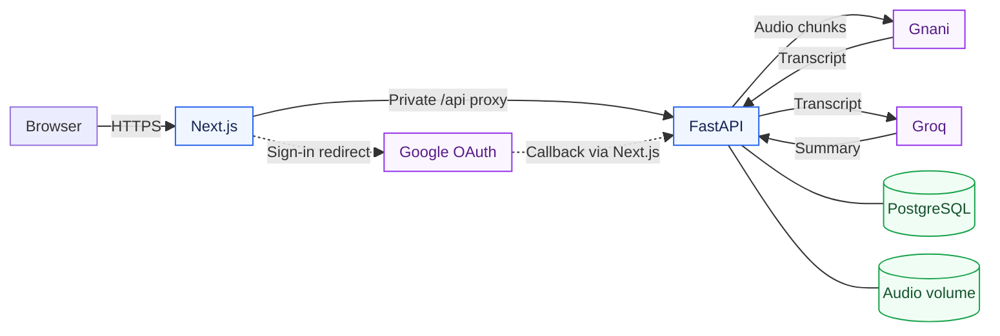
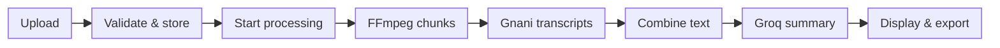

# Sonora Architecture

Sonora turns audio into transcripts and summaries. Railway hosts the Next.js frontend, FastAPI backend, and PostgreSQL. Gnani transcribes speech; Groq summarizes the resulting text.

**Live app:** [sonora-notes.up.railway.app](https://sonora-notes.up.railway.app/)

## System overview

**Next.js** provides uploads, chunk progress, private history, and result exports. Its `/api/*` rewrites forward requests to FastAPI through Railway's private network. The browser uses one public origin; provider credentials stay in the backend.

**FastAPI** owns authentication, validation, file storage, processing, and result access. Gnani's transcript returns to FastAPI before it is sent to Groq; the providers do not communicate directly. Groq runs `openai/gpt-oss-20b` through an OpenAI-compatible API.

**PostgreSQL** stores users, hashed browser sessions, and account-owned recordings. The **audio volume** stores signed-in users' original audio under `/data/audio/`; it is storage attached to FastAPI, not another API endpoint. PostgreSQL has its own persistent volume.

## Recording flow

1. **Upload:** `POST /uploads` accepts WAV, MP3, M4A, FLAC, or OGG files up to 50 MiB. It returns a recording ID with status `uploaded`. Signed-in recordings go to persistent storage; guest recordings go to temporary directories.
2. **Start:** `POST /uploads/{id}/transcribe` reserves the recording and returns `202`. A FastAPI background task then processes it inside the same backend process. Concurrent starts are rejected; completed results can be returned without rerunning providers.
3. **Transcribe:** FFmpeg normalizes audio to mono, 16 kHz PCM WAV and splits it into ordered chunks. `AUDIO_CHUNK_SECONDS` defaults to 240 and accepts 1–240 seconds. Gnani processes each chunk sequentially, and the backend joins their transcripts in order.
4. **Summarize:** the transcript is retained before the LLM call. Text up to 8,000 UTF-8 bytes is summarized directly. Longer text is split without dropping characters, summarized in batches, then merged. Partial summaries are condensed again when needed; the process fails if they cannot be reduced.
5. **Retrieve:** the frontend polls `GET /uploads/{id}` every three seconds during processing. It displays the status, progress, transcript, summary, or actionable error. Copy and `.txt` downloads run in the browser.

### Progress and retries

Transcription progress is `completed chunks × 100 / total chunks`, rounded down. It is not a timer or a measure of uploaded bytes. Two chunks produce 0%, 50%, and 100%. At 100%, the job may still be `summarizing`; only `completed` means both results are ready.

Account progress is committed to PostgreSQL after each chunk; guest progress is updated in memory. Temporary conversion chunks are cleaned up after transcription. A failed summary can be retried using the retained transcript, avoiding another Gnani call. A transcription failure requires the original audio and reruns transcription rather than resuming a saved partial chunk.

Provider clients apply bounded retries to selected rate-limit and server responses. Exhausted retries and conversion failures produce readable errors. Failed file or database writes clean up incomplete uploads and release an unsuccessful guest quota reservation.

## Authentication and data ownership

Google sign-in uses OpenID Connect with `openid`, `email`, and `profile`, OAuth state, and PKCE. The callback returns through the frontend to FastAPI:

`https://sonora-notes.up.railway.app/api/auth/google/callback`

FastAPI creates or finds the user, rotates the browser session, and stores only a hash of its opaque session token in PostgreSQL. Session cookies are HttpOnly, Secure in production, and SameSite=Lax. Mutating requests validate the browser origin against `APP_URL`; authentication and recording responses use `Cache-Control: no-store`.

| Data | Signed-in user | Guest |
| --- | --- | --- |
| Original audio | Persistent `/data/audio/` file | Temporary directory |
| Recording metadata and progress | Account-owned PostgreSQL row | In-memory guest job |
| Transcript and summary | PostgreSQL | Server memory only |
| Session and quota | PostgreSQL session hash and expiry | PostgreSQL session hash, expiry, and one-upload flag |
| History | Latest 50 owned recordings | Not available |

Guests may upload one recording per browser session. Their results normally expire after 60 minutes; processing jobs are protected from expiry while active, and expiry is refreshed when processing finishes. A cleanup loop removes expired jobs and temporary files. Guest audio is removed once a transcript exists, allowing summary retries without retaining audio.

Guest results disappear on backend restart. Signing in does not import them: users must sign in before uploading to save a recording. Every recording read or processing request verifies account ownership or the guest session hash. Signing out revokes the database session and clears the frontend's private results. Google OAuth is currently in Testing mode, so only configured test users can sign in.

## Railway deployment

| Component | Runtime and configuration |
| --- | --- |
| Frontend | `/Frontend` Dockerfile; Next.js standalone server on port 3000; public Sonora Notes domain |
| Backend | `/backend` Dockerfile; Uvicorn on port 8010; one worker and one replica; private service |
| Database | Railway PostgreSQL, referenced by backend `DATABASE_URL` |
| Audio storage | Persistent backend volume mounted at `/data` |
| Summaries | Groq endpoint `https://api.groq.com/openai/v1` |

The frontend's build-time `BACKEND_URL` is `http://backend.railway.internal:8010`. Changing it requires a frontend rebuild. The backend's `APP_URL` is `https://sonora-notes.up.railway.app`, which controls OAuth redirects and allowed browser origins.

The frontend proxy rejects upload requests with a declared body size above 51 MiB. Next.js allows a 55 MB proxy buffer for multipart overhead; FastAPI separately enforces the actual 50 MiB file limit. These are different limits for different layers.

Backend startup validates production settings, checks writable storage, and initializes or upgrades the schema. Interrupted saved jobs become `failed` and can be manually retried. `/live` checks process liveness; `/ready` checks the database schema and writable storage. The frontend health check reaches `/api/ready` through its proxy.

The current volume uses `RAILWAY_RUN_UID=0` because its mount is root-owned. Running the container as a non-root user requires compatible volume permissions. Credentials are supplied through Railway Variables and are not embedded in frontend code.

## Boundaries of the current design

Background tasks and guest results live inside one backend process. They are not a durable queue and do not survive a restart. Multiple workers or replicas require a shared temporary result store and durable job coordination; account data and audio persistence alone do not solve that problem.

The application currently uses local disk or a Railway volume rather than object storage. It transcribes and summarizes speech, but does not implement speaker diarization, speech separation, or audio denoising. The guest allowance is a browser-session limit, not an identity-based quota.
