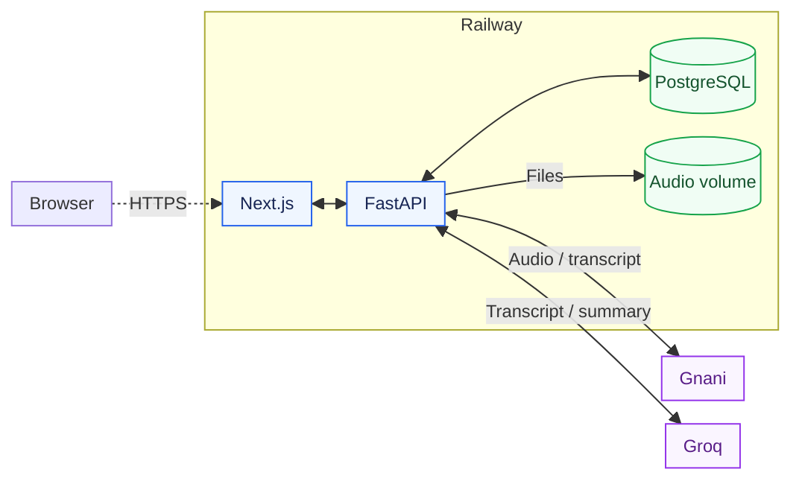
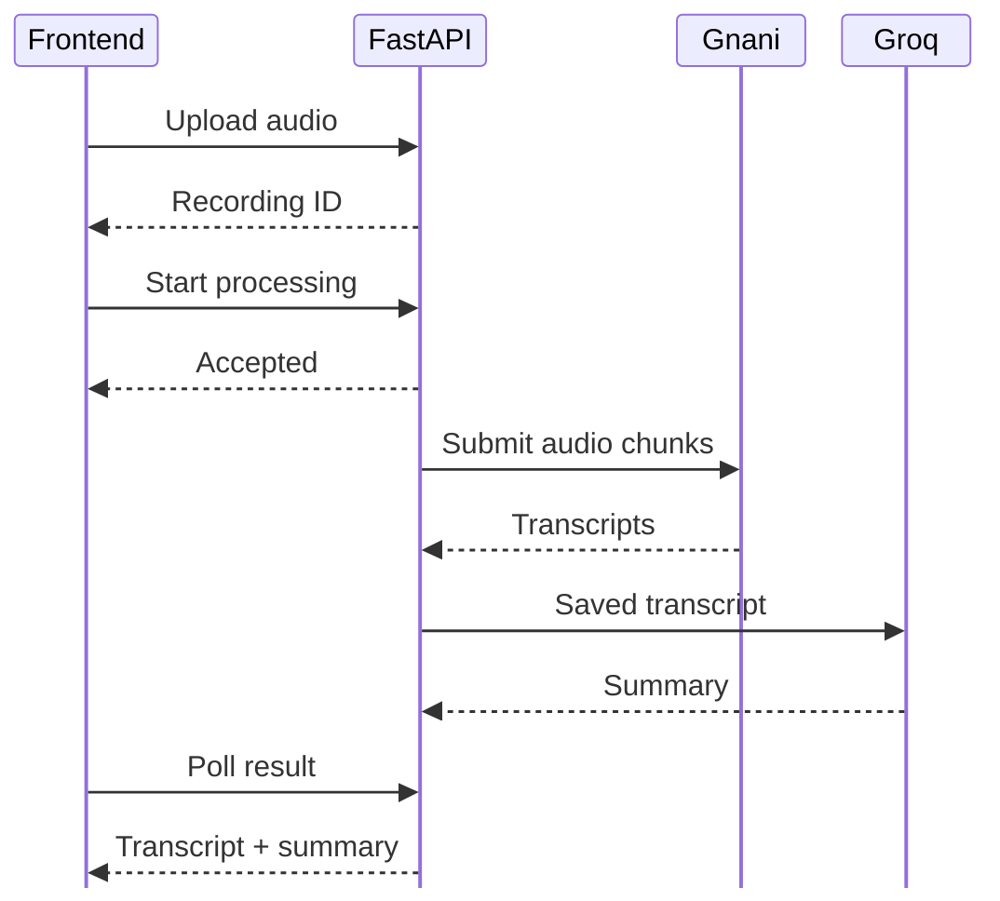

# Audio Notes Architecture

Audio Notes converts a recording into a transcript and a concise summary.
Railway hosts the Next.js frontend, FastAPI backend, and PostgreSQL database.
The backend uses Gnani for speech recognition and Groq for summarization.

## System overview

The **frontend** lets the user upload audio, start processing, reopen recordings,
and read or download results. Requests to `/api/*` pass through Next.js to the
backend using Railway's private network.

The **backend** validates uploads, stores recordings, prepares audio, calls the
providers, and saves each processing stage. API keys stay in backend environment
variables.

**PostgreSQL** holds recording IDs, filenames, storage paths, status, transcript,
summary, and error information. The **audio volume** holds the original files
under `/data/audio/`. PostgreSQL also has its own persistent volume.

**Gnani** receives audio and returns transcript text. **Groq** receives that
transcript and returns a summary using `openai/gpt-oss-20b`. The model runs at
Groq; Railway runs the application services.

## Processing a recording

Uploading and processing are separate operations. The upload request returns
once the original file and its database record have been saved. A second
request starts a background task, allowing the API to respond while the
recording is processed. The frontend polls the API for updates.

FFmpeg converts the recording into mono, 16 kHz WAV chunks of up to 240 seconds.
Chunks are transcribed in order, then joined into one transcript. Temporary
chunks are removed after processing; the original recording is retained.

The transcript is saved before the summary request. This lets a failed summary
be retried using the existing transcript instead of transcribing the audio again.

## Deployment design

The repository contains separate `Frontend/` and `backend/` folders.
Railway builds each service using its own Dockerfile. The frontend runs a
Next.js standalone server; the backend runs FastAPI with Uvicorn.

The frontend forwards requests to `backend.railway.internal:8010`.
The backend connects to the Railway PostgreSQL service and uses `/data`
for persistent audio storage. Provider URLs, model selection, and credentials
are supplied through Railway Variables.

Backend startup checks storage and initializes missing database tables.
Readiness checks verify database access and storage writes. Interrupted jobs
are marked as failed so the user can retry them.

Processing currently runs inside one backend instance rather than a separate
worker queue. Background tasks do not survive a restart. Audio supports
chunking, while summary input is currently bounded to 8,000 UTF-8 bytes.

The browser connection in the overview represents access after a frontend
public domain is enabled. The backend and database communicate privately
within Railway.

